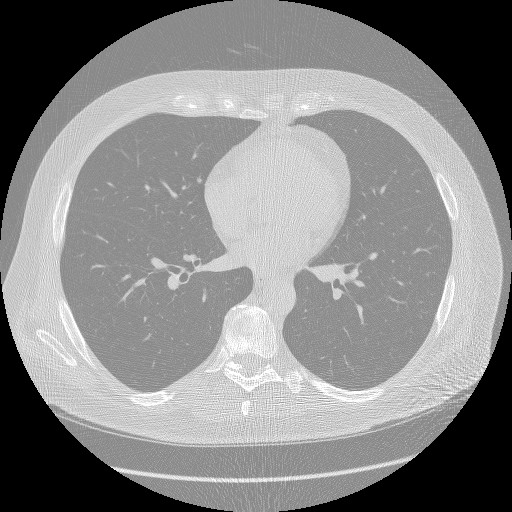
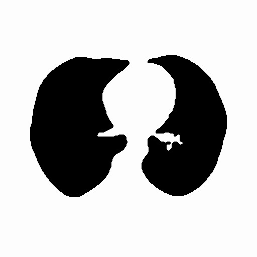
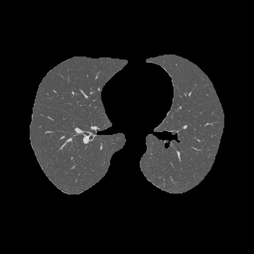
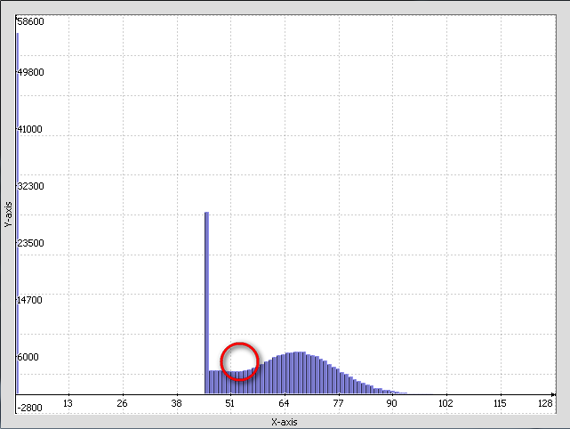
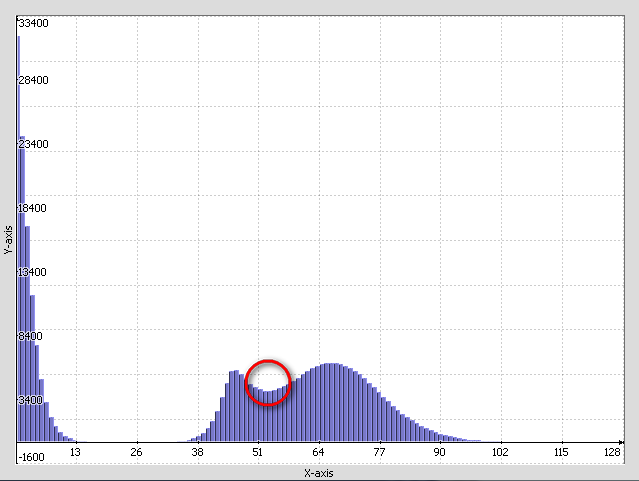
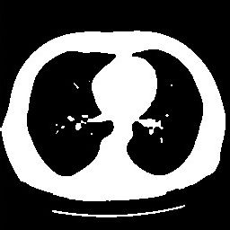
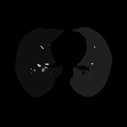

## Использование программы сегментации изображения КТ лёгкого

На вход ожидается файл с изображением КТ обследования в формате Analyze 7.5

Результатом работы сегментатора будут два файла в том же формате. Один представляет собой маску для сегментации с суффиксом _mask, во втором файле _segm содержится сегментированное изображение лёгкого. 

> Запуск сегментации:
>   
> 	ct-segmentation.exe W0001.hdr
> 
> Результат сегментации: 
> 
> 	W0001_mask.hdr   
> 	W0001_mask.img  
> 	W0001_segm.hdr  
> 	W0001_segm.img

### На примере одного изображения

Слой №138 из серии W0001.  
  

Область лёгкого отмечена нулями, фон - единицами.

Пикселам фона присваивается наименьшее значение из найденных на оригинальном изображении.

## Алгоритм сегментации
Вся серия сегментируется послойно. Для каждого слоя:

- находится пороговое значение, отделяющее область, похожую на лёгкое, от области, не похожей на лёгкое;
- слой сегментируется по найденному пороговому значению;
- сегментированные участки удаляются либо сливаются с другими;
- финальная маска применяется к исходному слою, и получается один слой сегментированного лёгкого.

### Пороговое значение для сегментации
Определяется по гистограмме. Только гистограмма строится для редуцированного изображения: все значения нормализуются в диапазон [0, 255], а после в каждый карман гистограммы считается два последовательных уровня яркости. 

Красной окружностью отмечена область расположения нужного нам порогового значения.  
 

Размываем гистограмму окном в три пиксела.  
 

Получается три явных пика. Самый первый и самый большой - фон, два следующих - лёгкое и кости.

Пороговое значение находится по критерию минимального среди восьми соседей (локальный минимум). Локальные минимумы могут встречаться между первым и вторым пиком гистограммы, а также после третьего. Чтобы исключить лишние значения, установлено минимально допустимое значение для порога. В текущей версии программы оно равно трём.  

### Сегментация и разметка областей
Размер слоя уменьшается в четыре раза (в два раза по каждой стороне). Дальше к нему последовательно применяются:

- медианный фильтр,
- сегментация по найденному порогу,
- наращивание (дилатация, dilate),
- эрозия (erode).

 

Из каждого угла изображение заливается (floodfill) фоновым цветом сегментации.

Разметку областей хорошо делает функция библиотеки CImg. 

 

После разметки внутренние области сливаются с внешними. Удаляются мелкие изолированные участки, а также участки с центроидами в экстремальных областях изображения. 

Размер изображения возвращается к исходному, т.е. удваивается.

## Изображения и сторонние библиотеки

Источник тестовых данных: [ELCAP Public Lung Image Database](http://www.via.cornell.edu/lungdb.html)
  
Оригинальные DICOM серии конвертировались в формат Analyze 7.5 с помощью программы [MRIConvert v 2.0 rev. 235](http://lcni.uoregon.edu/~jolinda/MRIConvert/).

Библиотека обработки изображений: [CImg v 1.5.6](http://cimg.sourceforge.net)

